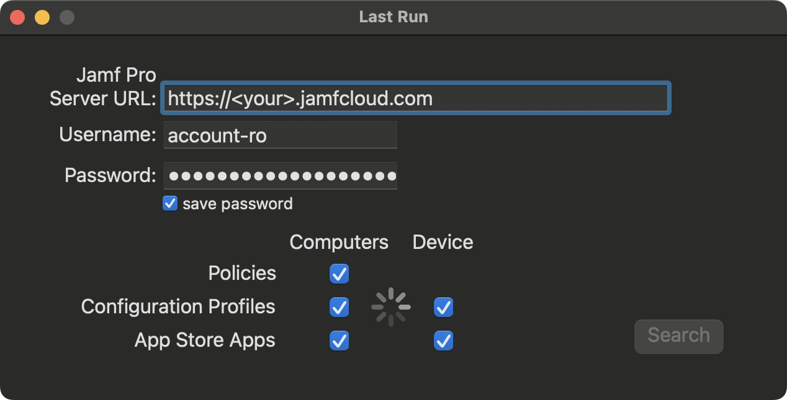

# Last Run 

Download: [Last Run](https://github.com/BIG-RAT/Last-Run/releases/latest/download/Last.Run.zip)

Find the last time a policy was run, or a configuration profile/app store app was deployed. 

Hold the option key while clicking on one of the object check boxes will select/deselet all of them. 

Once the search is complete results will be displayed in a separate window.  Results can be exported and saved (tab delimited) to your Downloads folder.

Application log can quickly be accessed from the menu bar, View --> Show Logs or ⌘ L.

## History

- 2022-11-28 v0.5.0: Initial release.